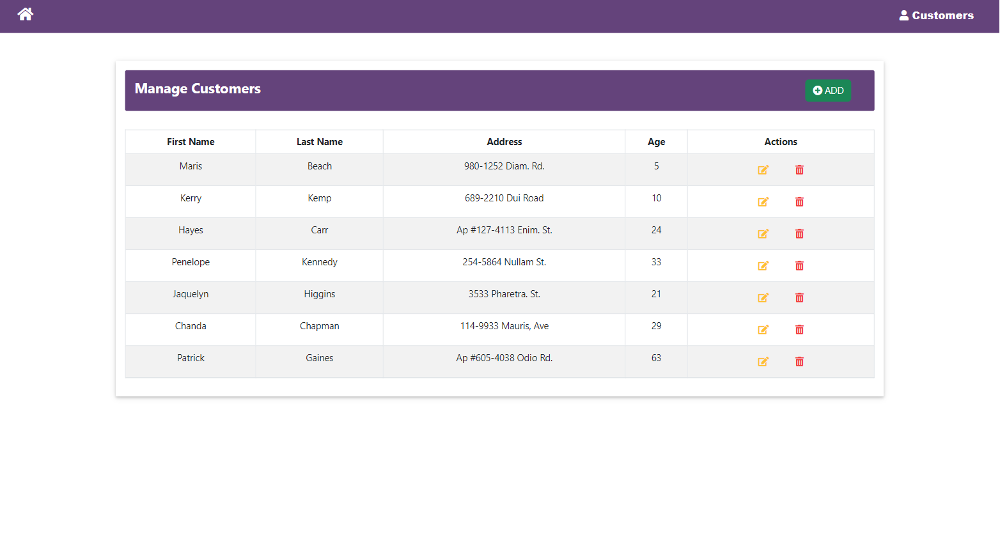
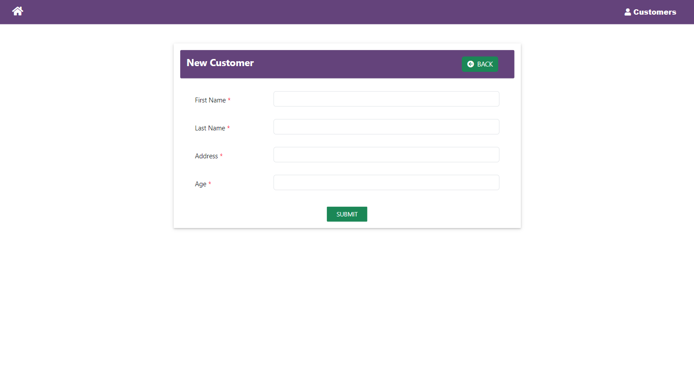
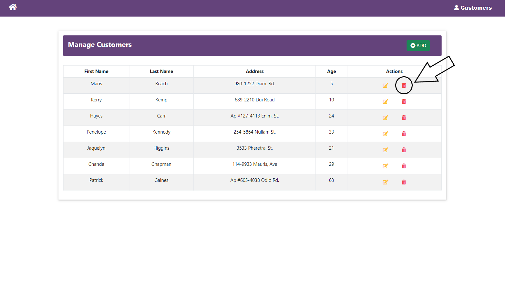
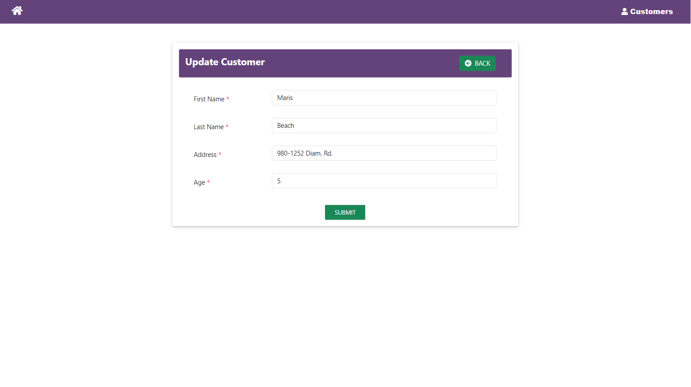

# CRUD application ⌨

My CRUD project with Angular, Bootstrap and MongoDB.

---

### #1 Customer list (READ)

---
### #2 Add customer (CREATE)

---
### #3 Delete a customer (DELETE)

---
### #4 Edit a customer (UPDATE)

---
